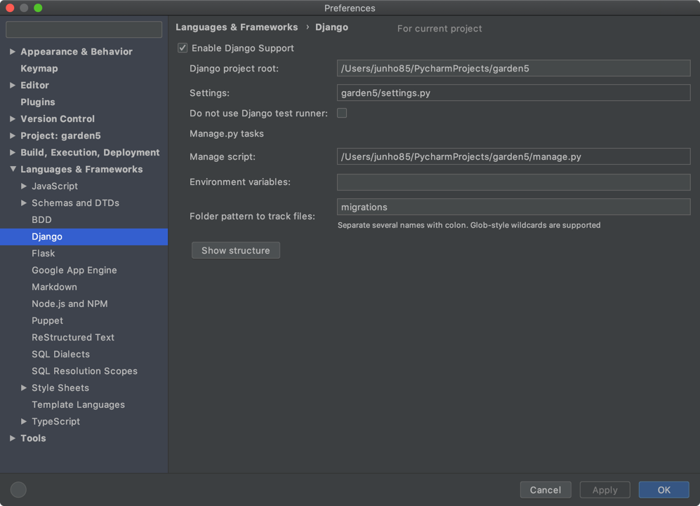

# django
출석부 웹프레임워크로 django 를 이용하고 있습니다. 버전은 django3

## git clone
```
git clone git@github.com:junho85/garden5.git
```

## virtualenv 환경 세팅
virtualenv 가 없다면 먼저 설치 해 줍니다. (있다면 패스)
```
pip3 install virtualenv
```

virtualenv 로 python3 환경을 세팅합니다.
```
python3 -m virtualenv venv
source venv/bin/activate
```

## modules installation
필요한 모듈들을 설치해줍니다. requirements 에 필요한 모듈들이 기입되어 있습니다.
```
pip install -r requirements.txt
```

pip 로 하나하나 직접 설치 해 줄수도 있습니다.
```
pip install slack-sdk
pip install Django
pip install psycopg2-binary
...
```

## django 구동
django 구동
```
python manage.py runserver
```

이건 뭔 차이더라?
```
python manage.py runserver 0:8000 
```

서버가 구동 되면 아래 주소로 접속 해 봅니다.
[http://localhost:8000/attendance/](http://localhost:8000/attendance/)

config.ini 와 users.yaml 설정이 안되어 있으면 오류페이지가 나타납니다.

기본 8000 인데 ufw 방화벽 오픈 하고 싶은 경우
```
sudo ufw allow 8000
```

## PyCharm 에서 django 활성화 하는 방법
* Preferences -> Languages & Frameworks -> Django 에서 Enable Django Support
